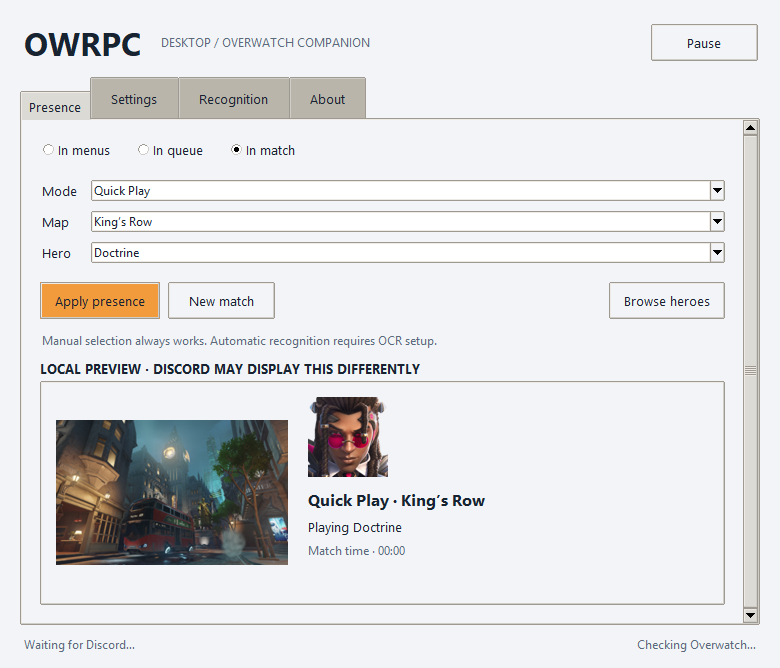

# OverwatchRPC

A small Windows tray companion for **Overwatch + Discord Rich Presence**.
Choose your hero, map and game mode, preview your activity, and keep the app out
of the way while you play. No Chromium runtime, account login or Discord token.




## Why this refresh exists

The original OWRPC was a useful console script, but its 2019 dependencies, map
list and terminal-only workflow had become outdated. Seven years later, I
decided to update it into a practical desktop companion: a tray icon, a compact
window, persistent settings, current hero portraits and modern Discord activity
fields. This repository preserves the old history and credits while replacing
the primary entry point with the desktop application.

**Thank you to [Tominous](https://github.com/Tominous/owrpc) for the original code
shared in their repository, and to [maxicc](https://github.com/maxicc/owrpc), the
original author credited in the source.** Their work made this refresh possible.
The untouched console implementation is kept as `legacy_cli.py` for reference;
its old network checks and catalogs are not part of the supported desktop flow.

## Get started on Windows

1. Download **OverwatchRPC-Windows.zip** from
   [Releases](https://github.com/Olmae/OverwatchRPC/releases).
2. Extract the **entire folder** to a permanent location. Keep `OverwatchRPC.exe`
   and its `_internal` directory together; Python is not required.
3. Open the desktop Discord client and enable **Activity Privacy → Share your
   detected activities with others**. Browser-only Discord cannot accept local RPC.
4. Launch `OverwatchRPC.exe`, start Overwatch, choose **In match**, select a mode,
   map and hero, then click **Apply presence**.
5. Allow up to the configured update interval (15 seconds by default), and check
   your profile from another Discord account.

Closing the window hides it in the tray once the tray is ready. Right-click the
tray icon for phase controls, Pause/Resume and Quit. **New match** clears old
selections and resets the timer. Settings are saved to `%APPDATA%\OWRPC`.

This is an **unsigned beta**. Beta.2 launched in Windows 11 ARM64 under x64
emulation and published real Discord activity with a hero portrait and match
timer. Real-game OCR and the full tray/startup lifecycle still need testing on a
gaming PC. Please use the
[Windows acceptance checklist](docs/WINDOWS-TESTING.md).

## What is included

- Tkinter desktop UI, notification-area menu, Windows startup and single-instance guard.
- Manual menus/queue/match state, editable hero/map/mode fields and a searchable hero gallery.
- Hero portraits and map thumbnails in an offline local preview.
- Persistent settings, match timer, pause/clear and automatic Discord reconnection.
- Optional game-process gating, enabled by default: only publish while `Overwatch.exe` runs.
- Current `pypresence` 4.6.2 activity fields: external HTTPS artwork, clickable hero
  image, optional URL button and application-name/state/details status display.
- Configurable application ID, image keys/URLs, custom text and update interval.
- Experimental local OCR, enabled by default; no game-memory access or injection.
- Portable Windows build, frozen dependency checks, unit tests and UI smoke checks.

## Catalog: October 6, 2026

The snapshot includes **54 heroes**, checked directly against Blizzard's official
roster, and **59 map entries** from OverFast. It includes newer heroes such as
Anran, D.Mon, Doctrine, Domina, Emre, Freja, Hazard, Jetpack Cat, Mizuki, Shion,
Sierra, Vendetta and Wuyang. Doctrine was missing from the API hero list when
retrieved, so hero names and portrait URLs come from Blizzard directly.

Maps include standard, legacy Assault, Arcade, Stadium, practice and Workshop
entries, including Aatlis, Gogadoro, Hanaoka, Neon Junction, Runasapi, Throne of
Anubis, Watchpoint: Grimsvotn and Wuxing University. This is a reference catalog,
**not the current Competitive rotation**, and it does not enumerate every seasonal
variant as a separate map. Unlisted names can be entered manually.

All 54 hero thumbnails are bundled. Map screenshots were available for 57 of the
59 entries; Neon Junction and Watchpoint: Grimsvotn returned HTTP 404 from the
provider. Their names remain selectable and use the fallback Discord artwork.
Source URLs, original image URLs, hashes and retrieval time are stored in
[`assets/catalog.json`](assets/catalog.json). Game artwork belongs to Blizzard;
see [artwork attribution](assets/NOTICE.md).

Sources:

- [Official Blizzard hero roster](https://overwatch.blizzard.com/en-us/heroes/)
- [Official October 6 patch notes](https://overwatch.blizzard.com/en-us/news/patch-notes/#patch-2026-10-06)
- [OverFast map API](https://overfast-api.tekrop.fr/maps) and
  [MIT-licensed source](https://github.com/TeKrop/overfast-api)
- [Discord Rich Presence documentation](https://docs.discord.com/developers/rich-presence/overview)
- [pypresence documentation](https://qwertyquerty.github.io/pypresence/html/doc/presence.html)

## Discord settings

The historical application ID is retained for compatibility. It is public; no
account password or user token is used. If that old Discord application stops
working, create an application in the [Developer Portal](https://discord.com/developers/applications)
and paste its application ID into Settings. Its application name determines the
activity name; it is not freely renamed by this companion.

Official hero portraits use external HTTPS URLs, so they do not depend on uploading
every new hero to the historical application's asset library. Map images use the
provider's original screenshot URLs. If Discord cannot render an external image,
disable that artwork option and use asset keys uploaded to your own application.
For an app without the historical `overwatch` asset, clear or replace that key.

The optional button needs an HTTP(S) URL and a label. Your own Discord client may
hide your own buttons; inspect the activity from another account. This companion
does not implement lobby joining, party invitations or spectating: the game does
not provide those integrations here. No Discord Social SDK login is needed for
this local IPC companion.

Updates are limited to at least 15 seconds. Unchanged payloads are skipped on
routine polls and refreshed at least once per minute at the default interval,
so a restarted Discord connection can be detected even without a hero change.
Pause clears presence without waiting for the next scheduled update; resume and
manual changes publish on the next interval. If Discord restarts, connection is
retried in the background.

## Automatic recognition

Automatic scene/hero/map recognition is enabled by default. It can be switched off in Additional. The Windows build
uses the operating system's local OCR engine; no Tesseract installation,
WebView, cloud service, or manually selected rectangles are required.
Choose English or Русский from the recognition language dropdown. The corresponding OCR
language must be installed in Windows. Interface language is separate.

The app captures only the foreground Overwatch window. It reads enlarged UI
regions and uses text positions, not team colors, to distinguish menus,
search, gameplay HUD, scoreboard and results. Search takes precedence over
a gallery or practice-range screen. Names/maps in match history are ignored.
Two observations confirm changes; unknown frames retain the last known state.

Tab provides the current map, mode when displayed, and own hero name on the
right. During gameplay the HUD can provide your nickname. For reliable E/A/D,
enter your exact game nickname in Advanced and enable the scoreboard option.
The app locates your row by name rather than highlight color. Small digit
shape templates supplement OCR. Ambiguous rows/counters are not published.
Automatic recognition is enabled by default for new settings. A saved explicit
opt-out is preserved, and E/A/D remains an independent opt-in option.

With automatic recognition enabled, menu presence also shows **Solo** or
**In a party: N players**, including yourself. It counts the visible profile
portrait tiles at the right of the menu header, not the social/friends counter,
voice channel count, or in-match team count. Two observations confirm a change;
unknown/hidden strips retain a value only briefly before it expires. Custom state
text still overrides this label. The supplied 1/2/3-player layouts and palette
variants were checked; arbitrary avatars, UI scaling and larger groups need more
real-game validation. No extra OCR pass or in-game overlay is added for this feature.

The offline catalog includes official Russian names for all 54 heroes and an
initial subset of map names. Russian names are also used in localized Discord
activity text; other catalog identities remain stable.

Stats only update while Tab is visible, expire from Discord when stale, and
clear when entering another phase. Hero switches without a readable selection
screen or Tab remain unconfirmed. The app does not press Tab for you. A Tab press in the foreground game starts
recognition immediately, with one follow-up while the key remains held. Keep the
scoreboard open until both reads finish; the first Windows OCR startup can take
longer. Holding Tab then returns to the configured polling interval.

A supplied Russian Havana scoreboard also validates hero, map, elapsed time and
E/A/D, including changed palette variants. Mixed Latin nicknames in a Russian
interface can start a second persistent OCR helper; both helpers stop on pause.
Large condensed titles on the supplied Portuguese selection screen still leave
hero/mode unconfirmed even though the scene and map are recognized.

This is experimental. The supplied English screenshots and a Russian search
screen are the initial validation corpus, not proof across all heroes, skins,
UI layouts, resolutions, languages, or a live game session. Borderless/windowed
mode is recommended; black captures and unrecognized screens retain manual
controls. Screenshots and readings are neither uploaded nor saved by the app.
Legacy Tesseract calibration fields remain readable in saved settings but are
not used by this automatic Windows provider.

## Run from source

Use Python 3.12+ with Tkinter (included in the python.org Windows installer).

```powershell
git clone https://github.com/Olmae/OverwatchRPC.git
cd OverwatchRPC
py -3.12 -m venv .venv
.venv\Scripts\python -m pip install -r requirements.txt
.venv\Scripts\python owrpc.py
```

`--hidden` requests tray startup; if the tray is unavailable, the window stays
accessible. `--self-test` validates imports, catalog structure and Discord payload
serialization without connecting to Discord or capturing the screen.

The target is Windows 10/11 x64. Windows 11 ARM64 can run the x64 build through
Windows emulation; its dependency/catalog self-test passed in a Parallels VM.
This is not a native ARM64 binary. Other platforms can run the window when Tkinter
is available, but Windows startup, single-instance guard, tray and foreground OCR
are Windows integrations. Administrator privileges are not required.

## Build and maintain

```powershell
.venv\Scripts\python -m pip install -r requirements-build.txt
.venv\Scripts\python -m unittest discover -s tests -v
.venv\Scripts\python -m ruff check owrpc.py owrpc_app scripts tests
.venv\Scripts\python owrpc.py --self-test
.venv\Scripts\python scripts\smoke_ui.py
.venv\Scripts\python scripts\build_windows.py
```

PyInstaller builds `dist/OverwatchRPC/OverwatchRPC.exe` on Windows. A directory
build avoids extracting a bundled runtime on every launch. CI uploads the portable
ZIP and UI previews; version tags publish a prerelease with its SHA-256 checksum.

To refresh catalog and thumbnails explicitly:

```powershell
.venv\Scripts\python scripts\refresh_catalog.py --as-of YYYY-MM-DD
```

The script fetches **live** sources, not historical archives. The `--as-of` value
records a maintainer-reviewed cutoff; it does not automatically filter future
heroes. Review official patch notes and catalog changes before committing. The desktop app refreshes validated hero and map metadata daily in the background.
Bundled data and a local cache remain available offline.

## Troubleshooting

- **No activity:** desktop Discord must be running with activity sharing enabled;
  Overwatch must be running if game gating is enabled. Check application ID and
  `%APPDATA%\OWRPC\owrpc.log`. Browser Discord cannot provide local IPC.
- **No portrait:** try your own application ID; verify Discord can fetch the HTTPS
  source; optionally disable external artwork and use uploaded asset keys.
- **OCR unavailable:** install the selected Windows OCR language. Read Recognition
  Use manual selection when the game window or names are unreadable.
- **No tray:** the window remains usable and closing exits. Use Quit in About.
- **Startup after moving files:** disable Launch with Windows before moving the
  portable folder, then enable it from the new location.
- **Settings reset:** corrupt JSON is preserved as `settings.corrupt-*.json`;
  fix or restore it while the companion is closed.

There is no telemetry. Release checks and catalog refreshes can be disabled in Additional. Logs are local, rotated and exclude
screenshots and OCR readings. Idle CPU/RAM and in-game OCR accuracy still need
measurement on a real gaming PC; lightweight architecture is not a benchmark.

## License and thanks

Source code: [GNU GPLv3](LICENSE). Original history and attribution are preserved.
Thanks to Tominous, maxicc, the pypresence maintainers and TeKrop/OverFast.
Blizzard's artwork and trademarks are separately attributed and are not GPL code.
OverwatchRPC is unofficial and is not affiliated with Blizzard or Discord.

### Interface languages

The interface and standard Discord activity phrases support English, Russian,
Simplified Chinese, Brazilian Portuguese, Spanish, Traditional Chinese, Korean,
French and German. The system language is used by default; select a language in
Settings to switch immediately without resetting the current match or timer.
Hero and map identifiers retain their original catalog names. Custom activity
text is preserved verbatim. Interface language does not change OCR recognition.

Activity contains the everyday controls and a local Discord preview. Settings
contains language, startup, tray and timer preferences. Advanced groups Discord
connection, appearance and automatic recognition settings, with explanations.

### Optional scoreboard E/A/D

Enable the experimental scoreboard option in Advanced and enter your game
nickname. Local Windows OCR plus grayscale digit templates read your E/A/D
row when Tab is visible. No rectangle calibration or Tesseract is required.
Unknown or ambiguous rows are ignored; stale readings are omitted from
Discord. Manual state overrides are preserved. Real-game validation remains
necessary before treating recognition as reliable for every setup.


### Desktop dashboard

The Activity page shows the detected scene, hero, map, fresh party count and
match timer, with a Discord preview on the right. At smaller widths the cards
stack vertically. Manual corrections expand on demand. Preview examples do not
change the activity sent to Discord. Settings are grouped under Additional;
connection and artwork settings expand only when needed.

The menu presence includes a GitHub button by default. A custom button overrides
it. The original OWRPC mark is installed as the application icon. To also show
it as Discord's small menu artwork, set `menu_image` to its public HTTPS URL in
Additional → Activity appearance. Discord cannot load a local file. The preview
uses local artwork and explains any difference from the published payload.

Rounded buttons retain native keyboard activation, focus indication and disabled
states. Card corners are static images; hover feedback stops after its short
transition. Additional opens with the game nickname and optional E/A/D controls.


## Updates and dynamic data

On startup, OWRPC checks the official GitHub releases in the background. When a
newer version is available, it offers to open its release page. The app never
replaces executable files automatically. Stable builds check stable releases;
beta builds also consider newer prereleases. Checks can be disabled in Additional,
where a manual check is available. Update prompts are deferred while the game is
running or the app is hidden in the tray.

Hero metadata comes from Blizzard's official roster; map metadata comes from
OverFast. Validated updates are saved atomically in `%APPDATA%\OWRPC` and merged
with the bundled catalog, preserving reviewed translations and existing entries.
This updates names and artwork links, not live match statistics, balance data or
counter-pick recommendations. No bulk artwork download runs at startup.

## Report a bug

If something does not work, please [open an issue](https://github.com/Olmae/OverwatchRPC/issues).
Include the app version, Windows version, steps to reproduce, and what you
expected versus what happened. For recognition problems, mention the game
language, resolution and UI scale; a screenshot of the affected scene helps.
For freezes, describe which action triggered them and whether only the app or
the whole computer stopped responding. Relevant excerpts from
`%APPDATA%\OWRPC\owrpc.log` are useful. Remove nicknames, personal paths and any
other private information before sharing logs or screenshots.
